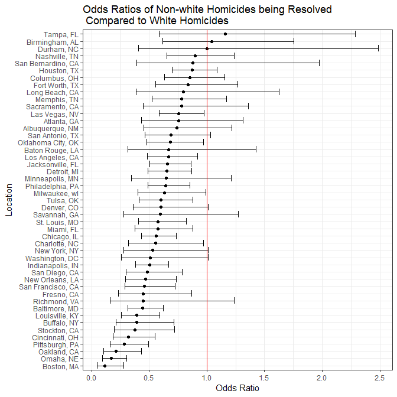
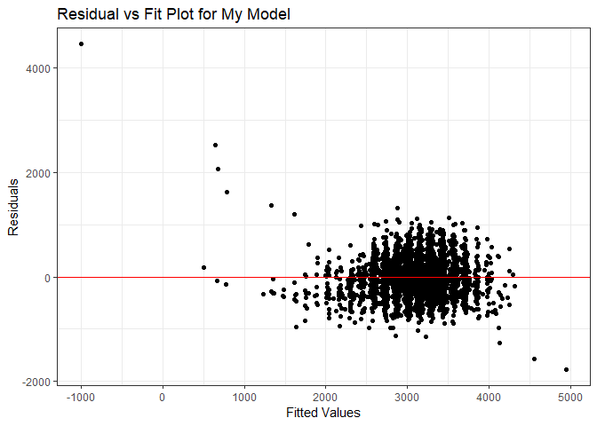
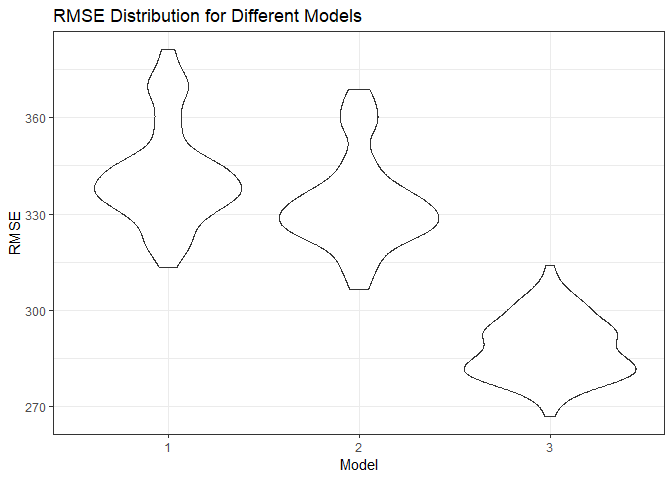

Homework 6
================
Rachel Tsong
27 November 2018

``` r
library(tidyverse)
```

    ## -- Attaching packages ---------------------------------------------------------------------------------------------------------- tidyverse 1.2.1 --

    ## v ggplot2 3.0.0     v purrr   0.2.5
    ## v tibble  1.4.2     v dplyr   0.7.6
    ## v tidyr   0.8.1     v stringr 1.3.1
    ## v readr   1.1.1     v forcats 0.3.0

    ## -- Conflicts ------------------------------------------------------------------------------------------------------------- tidyverse_conflicts() --
    ## x dplyr::filter() masks stats::filter()
    ## x dplyr::lag()    masks stats::lag()

``` r
library(modelr)
```

Problem 1
=========

``` r
## Import and clean data by creating binary variables for unsolved dispositions and race, filter out irrelevant cities
homicide = read_csv(url("https://raw.githubusercontent.com/washingtonpost/data-homicides/master/homicide-data.csv")) 
```

    ## Parsed with column specification:
    ## cols(
    ##   uid = col_character(),
    ##   reported_date = col_integer(),
    ##   victim_last = col_character(),
    ##   victim_first = col_character(),
    ##   victim_race = col_character(),
    ##   victim_age = col_character(),
    ##   victim_sex = col_character(),
    ##   city = col_character(),
    ##   state = col_character(),
    ##   lat = col_double(),
    ##   lon = col_double(),
    ##   disposition = col_character()
    ## )

``` r
homicide = homicide %>%
  mutate(city_state = str_c(city, state, sep = ", "),
         resolved = as.numeric(disposition == "Closed by arrest"),
         victim_age = as.numeric(victim_age),
         victim_race = ifelse(victim_race == "White", c("White"), c("Non-white")),
         victim_race = fct_relevel(victim_race, "White")) %>%
  filter(city_state != "Dallas, TX" & 
         city_state != "Phoenix, AZ" & 
         city_state != "Kansas City, MO" & 
         city_state != "Tulsa, AL")
```

    ## Warning in evalq(as.numeric(victim_age), <environment>): NAs introduced by
    ## coercion

In the code chunk above, I imported and cleaned the data. At first I was worried about the warning message when I recoded `victim_age` as a factor variable, but upon looking at the original data set there were instances in which the victim's age was unknown. These were changed to NAs when recoded to numeric, so I didn't see this as a problem.

``` r
## Fit logistic regression using age, race, and sex as predictors for resolved
baltimore_logistic = 
  homicide %>% 
  filter(city_state== "Baltimore, MD") %>%
  glm(resolved ~ victim_age + victim_race + victim_sex, data = ., family = binomial()) 

## Make a table showing the odds ratio and 95% CI 
baltimore_logistic %>%  
  broom::tidy() %>% 
  mutate(OR = exp(estimate),
         OR_upper_bound = exp(estimate + 1.96*std.error),
         OR_lower_bound = exp(estimate - 1.96*std.error)) %>%
  select(term, starts_with("OR")) %>%
  filter(term == "victim_raceNon-white") %>%
  knitr::kable(digits = 3)
```

| term                  |     OR|  OR\_upper\_bound|  OR\_lower\_bound|
|:----------------------|------:|-----------------:|-----------------:|
| victim\_raceNon-white |  0.441|              0.62|             0.313|

From this regression model, the odds of a homicide of a non-white victim being resolved in Baltimore is 0.44 times the odds of a homicide of a white victim being resolved, holding all other variables constant. We are 95% confident that the true odds ratio is between 0.31 and 0.62.

``` r
## Apply logistic regression function to each city, save results as a dataframe showing ORs and 95% CIs
homicide_logistic = homicide %>%
  group_by(city_state) %>%
  nest() %>%  
  mutate(regression = map(data, ~glm(resolved ~ victim_age + victim_race + victim_sex, data = ., family = binomial())),
         regression = map(regression, broom::tidy)) %>% 
  select(-data) %>%
  unnest()%>% 
  mutate(OR = exp(estimate),
         OR_upper_bound = exp(estimate + 1.96*std.error),
         OR_lower_bound = exp(estimate - 1.96*std.error)) %>%
  select(city_state, term, starts_with("OR")) %>%
  filter(term == "victim_raceNon-white") 
```

``` r
## Make a plot show ORs and CIs from each city
homicide_logistic %>%
  mutate(city_state = fct_reorder(city_state, OR)) %>%
  ggplot(aes(x = city_state, y = OR)) +
    geom_point() +
    coord_flip() +
    geom_errorbar(aes(ymin = OR_lower_bound, ymax = OR_upper_bound)) +
    labs(x = "Location", y = "Odds Ratio", title = "Odds Ratios of Non-white Homicides being Resolved \n Compared to White Homicides") +
    geom_hline(yintercept = 1, color = "red") +
    theme_bw() 
```



From this plot, we can see that in most large US cities, the odds ratio of a non-white homicide being resolved compared to a white homicide being resolved is less than 1.0, indicating that less non-white homicides are solved (holding all other variables constant). However, there are several cities where the 95% CI includes 1.0, so further investigation into these cities is required in order to determine if the true OR is less than 1.0.

Problem 2
---------

``` r
## Load birthweight data and change variables to factors
birthweight = read_csv("./birthweight.csv") %>%
  mutate(babysex = as.factor(babysex),
         frace = as.factor(frace),
         mrace = as.factor(mrace),
         malform = as.factor(malform)) 
```

    ## Parsed with column specification:
    ## cols(
    ##   .default = col_integer(),
    ##   gaweeks = col_double(),
    ##   ppbmi = col_double(),
    ##   smoken = col_double()
    ## )

    ## See spec(...) for full column specifications.

``` r
## Check for missing data
skimr::skim(birthweight)
```

    ## Skim summary statistics
    ##  n obs: 4342 
    ##  n variables: 20 
    ## 
    ## -- Variable type:factor ---------------------------------------------------------------------------------------------------------------------------
    ##  variable missing complete    n n_unique                      top_counts
    ##   babysex       0     4342 4342        2         1: 2230, 2: 2112, NA: 0
    ##     frace       0     4342 4342        5 1: 2123, 2: 1911, 4: 248, 3: 46
    ##   malform       0     4342 4342        2           0: 4327, 1: 15, NA: 0
    ##     mrace       0     4342 4342        4 1: 2147, 2: 1909, 4: 243, 3: 43
    ##  ordered
    ##    FALSE
    ##    FALSE
    ##    FALSE
    ##    FALSE
    ## 
    ## -- Variable type:integer --------------------------------------------------------------------------------------------------------------------------
    ##  variable missing complete    n      mean     sd  p0  p25    p50  p75 p100
    ##     bhead       0     4342 4342   33.65     1.62  21   33   34     35   41
    ##   blength       0     4342 4342   49.75     2.72  20   48   50     51   63
    ##       bwt       0     4342 4342 3114.4    512.15 595 2807 3132.5 3459 4791
    ##     delwt       0     4342 4342  145.57    22.21  86  131  143    157  334
    ##   fincome       0     4342 4342   44.11    25.98   0   25   35     65   96
    ##  menarche       0     4342 4342   12.51     1.48   0   12   12     13   19
    ##   mheight       0     4342 4342   63.49     2.66  48   62   63     65   77
    ##    momage       0     4342 4342   20.3      3.88  12   18   20     22   44
    ##    parity       0     4342 4342    0.0023   0.1    0    0    0      0    6
    ##   pnumlbw       0     4342 4342    0        0      0    0    0      0    0
    ##   pnumsga       0     4342 4342    0        0      0    0    0      0    0
    ##      ppwt       0     4342 4342  123.49    20.16  70  110  120    134  287
    ##    wtgain       0     4342 4342   22.08    10.94 -46   15   22     28   89
    ##      hist
    ##  <U+2581><U+2581><U+2581><U+2581><U+2585><U+2587><U+2581><U+2581>
    ##  <U+2581><U+2581><U+2581><U+2581><U+2581><U+2587><U+2581><U+2581>
    ##  <U+2581><U+2581><U+2581><U+2583><U+2587><U+2587><U+2582><U+2581>
    ##  <U+2581><U+2587><U+2585><U+2581><U+2581><U+2581><U+2581><U+2581>
    ##  <U+2581><U+2582><U+2587><U+2582><U+2582><U+2582><U+2581><U+2583>
    ##  <U+2581><U+2581><U+2581><U+2581><U+2582><U+2587><U+2581><U+2581>
    ##  <U+2581><U+2581><U+2581><U+2585><U+2587><U+2582><U+2581><U+2581>
    ##  <U+2582><U+2587><U+2585><U+2582><U+2581><U+2581><U+2581><U+2581>
    ##  <U+2587><U+2581><U+2581><U+2581><U+2581><U+2581><U+2581><U+2581>
    ##  <U+2581><U+2581><U+2581><U+2587><U+2581><U+2581><U+2581><U+2581>
    ##  <U+2581><U+2581><U+2581><U+2587><U+2581><U+2581><U+2581><U+2581>
    ##  <U+2581><U+2587><U+2586><U+2581><U+2581><U+2581><U+2581><U+2581>
    ##  <U+2581><U+2581><U+2581><U+2587><U+2587><U+2581><U+2581><U+2581>
    ## 
    ## -- Variable type:numeric --------------------------------------------------------------------------------------------------------------------------
    ##  variable missing complete    n  mean   sd    p0   p25   p50   p75 p100
    ##   gaweeks       0     4342 4342 39.43 3.15 17.7  38.3  39.9  41.1  51.3
    ##     ppbmi       0     4342 4342 21.57 3.18 13.07 19.53 21.03 22.91 46.1
    ##    smoken       0     4342 4342  4.15 7.41  0     0     0     5    60  
    ##      hist
    ##  <U+2581><U+2581><U+2581><U+2581><U+2583><U+2587><U+2581><U+2581>
    ##  <U+2581><U+2587><U+2585><U+2581><U+2581><U+2581><U+2581><U+2581>
    ##  <U+2587><U+2581><U+2581><U+2581><U+2581><U+2581><U+2581><U+2581>

After loading the data, I changed the categorical variables to factors. I checked for missing data using the `skimr::skim` function, and it appears as if there are no NA values.

``` r
## Make my model
bw_model_1 = lm(bwt ~ blength + ppbmi + smoken, data = birthweight)
```

My model for predicting an infants birthweight includes 3 predictors. First, I chose the baby's length at birth. Although height is not a completely accurate predictor for a human height due to differing BMIs, I still think that a baby's length is pretty well correlated to birthweight. I also added the mother's pre-pregnancy BMI. Obviously the mother and child share DNA, so the mother's body type could be correlated to the child's body type. I chose BMI over other factors such as height and weight because BMI incorporates both of these variables. Lastly, I chose number of cigarettes smoked per day during pregnancy because if there's anything Mailman has taught me, it's that smoking is bad! I predict that birthweight is negatively correlated with number of cigarette's smoked. For my model, I decided that 3 predictors would be enough to ensure parsimony.

``` r
## Plot residuals vs fitted values for my model
birthweight %>%
  add_predictions(., bw_model_1) %>%
  add_residuals(., bw_model_1) %>%
  ggplot(aes(x = pred, y = resid)) + 
    geom_point() +
    geom_hline(yintercept = 0, color = "red") +
    labs(x = "Fitted Values", y = "Residuals", title = "Residual vs Fit Plot for My Model") +
    theme_bw()
```



Although there is a dense cluster of residuals randomly distributed about 0, there are also a number of outliers. Additionally, these outliers follow a linear trend, instead of a random distribution. My model seems pretty good at accounting for variability, but there are definitely some values that my model does not account for.

``` r
## Use different predictors for birthweight
bw_model_2 = lm(bwt ~ blength + gaweeks, data = birthweight)

bw_model_3 = lm(bwt ~ bhead + blength + babysex + bhead * blength  + bhead * babysex + blength * babysex + bhead * blength * babysex, data = birthweight)
```

Here, I've fit two more models using different predictors for infant birthweight. The first one uses birth length and gestational age and the second one uses birth length, head circumfrence, and sex of the baby and all the interactions of these variables to predict birthweight. I am going to compare these models to my model using cross validation to compare root mean square errors.

``` r
## Make a cross validation dataset with 100 training and test pairs, apply models to training data sets, calculate RMSEs
cv_df =
  crossv_mc(birthweight, 100) %>% 
  mutate(train = map(train, as_tibble),
         test = map(test, as_tibble)) %>%
  mutate(bw_model_1 = map(train, ~ lm(bwt ~ blength + ppbmi + smoken, data = birthweight)),
         bw_model_2 = map(train, ~ lm(bwt ~ blength + gaweeks, data = birthweight)),
         bw_model_3 = map(train, ~ lm(bwt ~ bhead + blength + babysex + bhead * blength  + bhead * babysex + blength * babysex + bhead * blength * babysex, data = birthweight))) %>% 
  mutate(rmse_1 = map2_dbl(bw_model_1, test, ~ rmse(model = .x, data = .y)),
         rmse_2 = map2_dbl(bw_model_2, test, ~ rmse(model = .x, data = .y)),
         rmse_3 = map2_dbl(bw_model_3, test, ~ rmse(model = .x, data = .y)))
```

``` r
## Make violin plots showing the distribution of RMSEs for each model 
cv_df %>% 
  select(starts_with("rmse")) %>% 
  gather(key = model, value = rmse) %>% 
  mutate(model = str_replace(model, "rmse_", ""),
         model = fct_inorder(model)) %>% 
  ggplot(aes(x = model, y = rmse)) + 
    geom_violin() +
    theme_bw() +
    labs(x = "Model", y = "RMSE", title = "RMSE Distribution for Different Models")
```



From these distributions, it can be seen that model 3 appears to be the best predictor of birthweigh because it has the lowest RMSE.
